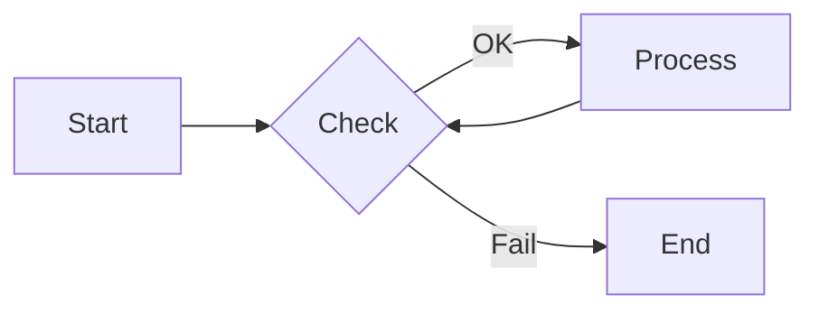
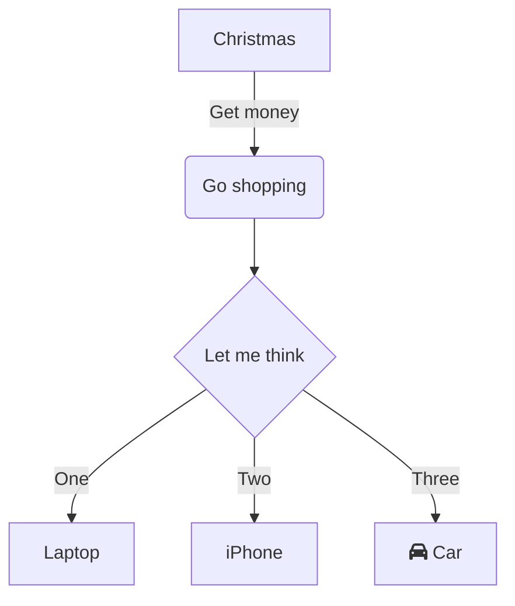

At this point, the blog has all the features I need for future posts. Code snippets, multi-language examples, math, diagrams, and publishing metadata are all in place. The setup now feels stable enough that I can focus on the content itself rather than spending time fixing formatting or tooling.

## Code Formatting

### Simple Example (CodeBlock)

Regular code blocks are handled by `CodeBlock.svelte`, which is enough for most single-language examples. That covers the common case where I just need a clean snippet with syntax highlighting and copy support.

```go
package main

import "fmt"

func main() {
    fmt.Println("Hello, World!")
}
```

### Advanced Example (CodeTabs)

For posts that need comparisons across languages, `CodeTabs.svelte` makes the examples much easier to read. It is especially useful when the same idea needs to be shown side by side in different languages without turning the page into a long sequence of repeated snippets.

:::code-tabs

```go title="Go"
func binarySearch(nums []int, target int) int {
	lo, hi := 0, len(nums)-1
	for lo <= hi {
		mid := lo + (hi-lo)/2
		if nums[mid] == target { return mid }
		if nums[mid] < target { lo = mid + 1 } else { hi = mid - 1 }
	}
	return -1
}
```

```rust title="Rust"
fn binary_search(nums: &[i32], target: i32) -> Option<usize> {
    let (mut lo, mut hi) = (0, nums.len());
    while lo < hi {
        let mid = lo + (hi - lo) / 2;
        match nums[mid].cmp(&target) {
            Ordering::Equal => return Some(mid),
            Ordering::Less => lo = mid + 1,
            Ordering::Greater => hi = mid,
        }
    }
    None
}
```

```zig title="Zig"
fn binarySearch(nums: []const i32, target: i32) ?usize {
    var lo: usize = 0;
    var hi: usize = nums.len;
    while (lo < hi) {
        const mid = lo + (hi - lo) / 2;
        if (nums[mid] == target) return mid;
        if (nums[mid] < target) lo = mid + 1 else hi = mid;
    }
    return null;
}
```

:::

## Math & Diagrams

### KaTeX Support

Math support is handled with [KaTeX](https://katex.org/), which is more than enough for the kind of notation I expect to use in future posts. If I need to draft equations in the browser, [LaTeX Editor](https://latexeditor.lagrida.com/) is a convenient option.

- **Inline**: $E = mc^2$
- **Block**:

  $$ \frac{n!}{k!(n-k)!} = \binom{n}{k} $$

### Mermaid Diagrams

Diagrams are powered by [Mermaid](https://mermaid.js.org/), which makes it easy to keep visual explanations close to the text. For drafting and testing diagrams, the [Mermaid Live Editor](https://mermaid.ai/live/) is useful.





## Public API & Resources

The blog also exposes a few useful endpoints that are already ready to use:

- [Atom Feed](/atom.xml)
- [RSS Feed](/rss.xml)
- [Sitemap](/sitemap.xml)
- [Search Index](/api/search.json)

## Markdown Kitchen Sink

This section exists mostly as a reference point for the post renderer. If typography, spacing, or prose styles ever drift between local development and production, these are the elements that should make it obvious.

> A good content pipeline should make ordinary writing feel boring in the best possible way.

The current markdown layer already covers the basic text structures I expect to use most often:

- unordered lists for short collections
- ordered lists for step-by-step notes
- tables for small comparisons
- blockquotes for emphasis or commentary

That also makes it easier to keep technical posts readable without reaching for custom components too early:

1. start with plain markdown
2. switch to `CodeBlock` or `CodeTabs` when code needs more structure
3. use math or Mermaid only when the idea genuinely needs it

| Element | Purpose                          | Status |
| ------- | -------------------------------- | ------ |
| Lists   | Organize short sequences         | Ready  |
| Tables  | Compare small pieces of data     | Ready  |
| Quotes  | Highlight commentary or emphasis | Ready  |
| Code    | Show snippets and examples       | Ready  |

---

## Links & Resources

These are the main tools behind the current setup:

- **Framework**: [Svelte Documentation](https://svelte.dev/docs/svelte/overview)
- **Markdown**: [Markdown Syntax Guide](https://www.markdownguide.org/)
- **Math Editors**: [LaTeX Editor](https://latexeditor.lagrida.com/)
- **Diagramming**: [Mermaid Live Editor](https://mermaid.ai/live/)

Overall, this is already enough for the kind of writing I want to publish next. The core pieces are in place, the workflow feels stable, and future posts can focus more on content than on formatting.
