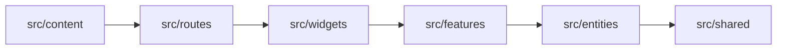
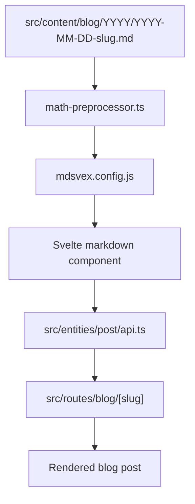
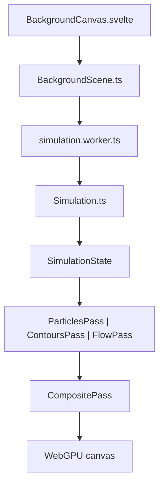

This post is internal documentation for the project.

The purpose of it is practical: to document how this site is structured, why the main architectural decisions were made, and where to start when something needs to be extended, changed, or debugged. This is not meant to be a generic overview of the stack. It is a working map of this specific codebase.

## What This Project Actually Is

This repository is a static personal site built with SvelteKit. It is both a blog and a small portfolio, but it also has a non-trivial rendering layer for the animated background.

There are really four systems living together here:

1. The site shell and page routing.
2. The content pipeline for markdown posts.
3. The interactive UI layer for themes, search, and settings.
4. The background rendering engine built around WebGPU.

The project is intentionally static-first. That is why the deployment target is GitHub Pages and why the app uses `@sveltejs/adapter-static` in `svelte.config.js`. Pages are prerendered into `target/build`, and the routes are designed to behave well as static output.

## Core Stack and Why It Was Chosen

### Svelte 5 and SvelteKit 2

The frontend is built on Svelte 5 and SvelteKit 2.

The important reason for choosing Svelte 5 is the Runes model. State is more explicit than the older implicit reactivity style, which makes this codebase easier to reason about once it grows beyond a toy app. This project deliberately avoids classic Svelte 4 stores and instead keeps state in class-based modules using `$state`, `$derived`, and `$effect`.

### Image Optimization Pipeline

The site uses a modern image pipeline powered by `@sveltejs/enhanced-img`.

Images are treated as part of the build graph:

- Source images are kept in `src/lib/assets/`
- They are imported with the `?enhanced` query suffix
- The pipeline automatically generates optimized versions (WebP, AVIF)
- It provides responsive `srcset` and `sizes` automatically

This approach ensures that we don't just "fix symptoms" of unoptimized images, but rather integrate optimization into the core development workflow.

### Tailwind 4 plus custom CSS variables

Styling is built on Tailwind CSS v4, but the real design system lives in CSS variables, mostly through:

- `src/app.css`
- `src/shared/styles/*.css`

Tailwind is used as a utility layer, not as the only styling system. The actual theme tokens, colors, typography decisions, and component states are controlled through variables such as `--color-bg`, `--color-text`, `--color-border`, and `--color-accent`.

That split is intentional:

- Tailwind makes layout and spacing fast
- CSS variables make dark/light theming and component-level consistency manageable

If I ever need to retheme the whole site, the first place to look is not a Svelte component. It is the shared CSS token layer.

### Bun, Vite, and the build workflow

The project uses Bun as the package manager and runtime for scripts, and Vite as the bundler.

The relevant files are:

- `package.json`
- `vite.config.ts`
- `svelte.config.js`

The build output goes to `target/build`, not the default SvelteKit location. Bundle reports also go into `target/bundle`.

That matters because this repo has a real CI and bundle-budget workflow, not just a local build:

- `bun run build` builds production output
- `bun run check` runs `svelte-check`
- `bun run test:unit` runs Vitest
- `just build` is the safe build gate
- `just ci` runs formatting, linting, type-checking, and build

If something feels broken in deployment, the first things to run are still:

1. `bun run check`
2. `bun run test:unit`
3. `just build`

## Project Structure and Why It Looks Like This

The codebase follows a pragmatic Feature-Sliced Design approach, not a dogmatic one.

The important top-level directories are:

- `src/routes` for routing and page composition
- `src/features` for app-level behavior and business-value modules
- `src/widgets` for bigger UI building blocks
- `src/entities` for core domain structures
- `src/shared` for reusable primitives and utilities
- `src/content` for markdown content
- `tests` for shared test setup and Playwright specs

### `src/routes`

This is where SvelteKit routing lives.

Important files:

- `src/routes/+layout.svelte`
- `src/routes/+page.svelte`
- `src/routes/blog/+page.svelte`
- `src/routes/blog/[slug]/+page.svelte`
- `src/routes/blog/[slug]/+page.ts`
- `src/routes/blog/tag/[tag]/+page.svelte`
- `src/routes/api/search.json/+server.ts`
- `src/routes/rss.xml/+server.ts`
- `src/routes/atom.xml/+server.ts`
- `src/routes/sitemap.xml/+server.ts`

`+layout.svelte` is the real shell of the site. It loads global CSS, mounts the header and footer, attaches the background canvas, mounts the theme manager, and initializes the command palette. It is the place where the application feels assembled.

### `src/features`

This is where app behavior lives when it is more than a single reusable component.

The key features are:

- `background`
- `engine`
- `theme`

`background` is the orchestration layer between UI and rendering.

`engine` is the lower-level rendering system.

`theme` is global state plus toggles for dark mode, reading mode, and code themes.

This split is deliberate. The `engine` feature should not know about layout widgets, and UI widgets should not know how GPU buffers or simulation workers work.

### `src/widgets`

Widgets are larger UI blocks made of smaller shared primitives or feature state.

Examples:

- `widgets/layout/ui/Header.svelte`
- `widgets/layout/ui/Footer.svelte`
- `widgets/search/ui/CommandPalette.svelte`
- `widgets/blog/ui/PostList.svelte`
- `widgets/post/ui/PostHeader.svelte`
- `widgets/post/ui/PostFooter.svelte`

The practical rule is:

- if something is a page-scale or section-scale building block, it probably belongs in `widgets`
- if something is a tiny reusable primitive, it probably belongs in `shared/ui`

### `src/entities`

Entities are the domain objects the site is built around.

Right now the most important one is `post`.

Relevant files:

- `src/entities/post/post.ts`
- `src/entities/post/api.ts`
- `src/entities/post/ui/PostCard.svelte`

`api.ts` is the core post registry. It reads metadata from markdown via `import.meta.glob`, validates it, normalizes the slug, sorts posts, and logs content issues if metadata is invalid. If content mysteriously disappears from the site, this file is one of the first places to inspect.

### `src/shared`

This is where truly reusable code goes.

Examples:

- `src/shared/ui/CodeBlock.svelte`
- `src/shared/ui/CodeTabs.svelte`
- `src/shared/ui/MathCopy.svelte`
- `src/shared/lib/actions/copy.ts`
- `src/shared/lib/actions/mermaid.ts`
- `src/shared/config/site.ts`

If I find myself trying to put app-specific behavior into `shared`, that is usually a sign that it actually belongs in `features` or `widgets`.

## Content Model and Writing Pipeline

The content system matters because this blog is not just rendering markdown passively. The markdown pipeline is doing real work.

### Where content lives

Posts live under:

- `src/content/blog/YYYY/YYYY-MM-DD-slug.md`

Static content pages live under:

- `src/content/pages`

This naming scheme is intentional.

It gives:

- chronological sorting in the filesystem
- readable filenames
- stable slugs
- a clean separation between blog content and static pages

The current slug behavior preserves the full filename without `.md`, which means dated URLs are canonical. That logic lives in `src/entities/post/api.ts`.

### How posts are loaded

Post metadata is loaded with `import.meta.glob` in `src/entities/post/api.ts`.

That file is responsible for:

- eagerly loading frontmatter metadata
- validating required fields like `title`, `created`, `tags`, and `readingTime`
- logging invalid content
- constructing the `slug`
- filtering drafts
- sorting posts newest-first

This is the content registry of the application. It is simple, but it is a central piece of the site.

### The markdown processing chain

The content preprocessing order is important and easy to forget, so it is worth writing down explicitly.

The chain is configured in `svelte.config.js`:

1. `mathPreprocess()`
2. `vitePreprocess()`
3. `mdsvex(mdsvexConfig)`

This order is not arbitrary.

`mathPreprocess` must run before mdsvex so that LaTeX backslashes survive and math gets converted into real Svelte component markup before normal markdown handling.

### `math-preprocessor.js`

The custom math/content preprocessor lives in:

- `src/lib/math-preprocessor.js`

It currently handles three important things:

1. KaTeX inline math conversion
2. KaTeX display math conversion
3. `:::code-tabs` blocks

That means the markdown authoring layer already supports:

- `$...$` for inline math
- `$$...$$` for display math
- `:::code-tabs` with fenced code blocks for language tabs

The preprocessor also auto-injects imports for `MathCopy.svelte` and `CodeTabs.svelte` when needed. That is important because it keeps the markdown source clean and avoids repetitive manual imports inside posts.

### `mdsvex.config.js`

This file is the second half of the content pipeline:

- `mdsvex.config.js`

Its main responsibilities are:

- reading time calculation
- syntax highlighting through Shiki
- Mermaid block transformation

Mermaid is handled specially. A `mermaid` code fence is converted into HTML that includes:

- the raw diagram source in base64
- a wrapper that supports copy-to-clipboard
- a `.mermaid` node that gets upgraded later by the Mermaid action

That split is deliberate: the markdown stage keeps the source text, while runtime enhancement turns it into an actual diagram.

### Rendering a post page

The blog post route is:

- `src/routes/blog/[slug]/+page.svelte`
- `src/routes/blog/[slug]/+page.ts`

`+page.ts` is responsible for:

- generating prerender entries
- throwing a real `404` if a slug does not exist

`+page.svelte` is responsible for:

- looking up the current post metadata
- loading the matching markdown module
- rendering `PostHeader`, the markdown body, and `PostFooter`
- applying `copy` and `mermaid` actions to the `.prose` container

That separation is useful:

- `+page.ts` owns route validity
- `+page.svelte` owns presentation

## Search, Feeds, and Static Endpoints

This site exposes a few useful machine-readable outputs:

- `/api/search.json`
- `/rss.xml`
- `/atom.xml`
- `/sitemap.xml`

The search index is generated from posts in:

- `src/routes/api/search.json/+server.ts`

Feeds and sitemap are generated in their own route modules under `src/routes`.

This is important because content changes do not only affect HTML pages. They also affect derived outputs used by search, feed readers, and crawlers.

If something is wrong with feed content or indexing, the fix is usually not in the UI. It is in the post metadata or one of these endpoint generators.

## Theme and UI State

The theme system is one of the cleanest architectural decisions in this repo.

Instead of spreading state across components, the app keeps it in dedicated model files:

- `src/features/theme/model/theme.svelte.ts`
- `src/features/theme/model/codeTheme.svelte.ts`
- `src/features/theme/model/readingMode.svelte.ts`
- `src/features/theme/model/navAnchor.svelte.ts`

This gives a few concrete benefits:

- theme state is easy to inspect
- persistence logic can stay near the model
- UI components remain small and replaceable
- behavior is easier to test

The code-highlighting theme is also part of this state model. The app initializes code themes in `+layout.svelte`, and the rest of the site reads from that shared source of truth.

## WebGPU Stack: What It Is and How It Is Organized

This is the part most worth documenting, because it is also the easiest part to forget.

The background rendering stack is split into two layers:

1. `src/features/background`
2. `src/features/engine`

The reason for this split is simple:

- `background` knows about the site and the canvas as a product feature
- `engine` knows about simulation and rendering details

### The orchestration layer: `background`

The main file is:

- `src/features/background/core/BackgroundScene.ts`

This class is the orchestration point for the animated background.

Its responsibilities are:

- requesting the GPU device
- configuring the WebGPU canvas context
- spawning the simulation worker
- owning the active render mode
- owning the `CompositePass`
- reacting to resize
- reacting to theme changes
- forwarding cursor and click events into the simulation

This is the file to read first if the background stops working as a system.

It is effectively the coordinator between browser APIs, simulation state, and render passes.

### The simulation layer

The simulation logic lives in:

- `src/features/engine/core/Simulation.ts`
- `src/features/engine/core/simulation.worker.ts`
- `src/features/engine/core/SimulationState.ts`
- `src/features/engine/core/SimulationConstants.ts`

This is an important detail: the project is not doing the particle simulation in GPU compute shaders right now. The site uses WebGPU for rendering, but the particle simulation itself currently runs on the CPU inside a worker.

That decision is pragmatic and still valid.

Why it is structured this way:

- the worker keeps simulation work off the main thread
- the CPU side is easier to debug than an early GPU compute pipeline
- rendering still benefits from the GPU
- the architecture leaves room to migrate more work onto the GPU later

`Simulation.ts` owns:

- particle positions and velocities
- color assignment
- cursor interaction
- click bursts
- resize behavior
- Delaunay triangulation via `d3-delaunay`
- edge generation
- triangle generation
- density and velocity fields for some visual modes

This means `Simulation.ts` is not just “move particles”. It is really the geometric data source for the whole background system.

### Why `d3-delaunay` is in the stack

`d3-delaunay` is there because the project needs neighborhood and triangle information, not just particle positions.

That is what enables:

- connection edges
- mesh-like triangle fills
- contour-style interpretations of particle distribution

Without Delaunay, the engine would still have particles, but it would lose much of the visual structure that makes the background feel alive instead of random.

### The render-pass layer

Render passes live in:

- `src/features/engine/passes/ParticlesPass.ts`
- `src/features/engine/passes/ContoursPass.ts`
- `src/features/engine/passes/FlowPass.ts`
- `src/features/engine/passes/CompositePass.ts`
- `src/features/engine/passes/IPass.ts`

The abstraction is straightforward:

- each visual mode implements the `IPass` contract
- `BackgroundScene` swaps the current pass depending on the selected mode
- each pass knows how to initialize itself, resize, receive new simulation data, and draw

This is a good structure because each mode stays isolated. If I want to change one visual mode, I do not have to untangle a giant renderer with mode flags everywhere.

### What each pass is responsible for

`ParticlesPass.ts`

- draws the particle layer
- uses the simulation output directly
- is the simplest visual mode

`ContoursPass.ts`

- turns the underlying field into contour-like output
- depends on generated geometric or scalar data rather than just points

`FlowPass.ts`

- emphasizes directional or field-like structure from the simulation

`CompositePass.ts`

- owns the offscreen render target
- composites the final scene into the actual canvas
- applies the glass/refraction layer used by the UI
- reacts to theme and background-color changes

The most important architectural distinction is that `CompositePass` is not just another mode. It is the final composition layer that all modes pass through.

### Shader organization

WGSL shader files live in:

- `src/features/engine/shaders/particles.wgsl`
- `src/features/engine/shaders/edges.wgsl`
- `src/features/engine/shaders/triangles.wgsl`
- `src/features/engine/shaders/composite.wgsl`

This split is sensible and should stay that way.

It keeps shader responsibilities narrow:

- particles
- edges
- triangles
- final composition

If I add a new mode later, I should not rush to cram extra behavior into the existing shader set unless it is truly a variant of an existing pass.

### The real mental model of the rendering pipeline

If I need the shortest accurate summary, it is this:

1. UI and app state decide which background mode is active.
2. `BackgroundScene` owns the GPU device, canvas context, worker, and active pass.
3. The worker advances the simulation and returns `SimulationState`.
4. The active pass converts simulation data into GPU-friendly render buffers.
5. That pass draws into an offscreen target.
6. `CompositePass` draws the offscreen result into the visible canvas and applies the glass effect.

That is the whole loop in one place.

## Why the WebGPU stack is worth keeping

The background is one of the few parts of the site that gives it a distinct identity. It is also the most technically unusual part of the project.

The stack is worth keeping because:

- it creates a recognizable visual layer
- it isolates rendering complexity instead of leaking it through the app
- it is structured in a way that can evolve
- it is already testable enough to maintain

The main thing to remember is that this is not a general-purpose game engine. It is a specialized rendering subsystem for the site background. That is why the abstractions are pass-based and not more ambitious than they need to be.

## Build, Quality, and CI

The project has a fairly strict local and CI pipeline on purpose.

### Checks and tests

The main commands are:

- `bun run check`
- `bun run test:unit`
- `just lint`
- `just build`
- `just ci`

Unit tests are written with Vitest and Svelte Testing Library.

Playwright exists for E2E coverage, but the daily safety net is still:

- type-checking
- unit tests
- build

### Bundle tracking

Bundle analysis is configured directly in `vite.config.ts`.

The important outputs are:

- `target/bundle/stats.html`
- `target/bundle/stats.json`

These are not optional extras anymore. They are part of the ongoing bundle-budget monitoring workflow. If performance regresses, that is where to inspect the output first.

## If I Need to Continue Development Later

If I come back to this project after a long break, the easiest way to get back into it is to restore context in a fixed order:

1. Start with `README.md` to recover the high-level project rules, structure, and commands.
2. Read `src/routes/+layout.svelte` to remember how the app is assembled.
3. Read `src/entities/post/api.ts` to remember how content becomes site data.
4. Read `src/lib/math-preprocessor.js` and `mdsvex.config.js` to remember the markdown pipeline.
5. Read `src/features/background/core/BackgroundScene.ts` to restore the rendering flow.
6. Read `src/features/engine/core/Simulation.ts` to remember how particle and mesh data are produced.
7. Read the individual passes if I need to change a specific visual mode.

When adding a new user-facing feature:

- decide whether it belongs in `features`, `widgets`, or `shared`
- keep state out of random components
- prefer extending an existing layer over bypassing it

For content-rendering issues:

- check the markdown file
- check `api.ts`
- check the preprocessors
- check the route component

For background debugging:

- start at `BackgroundScene.ts`
- verify the worker is producing frames
- verify the active pass is initialized
- verify the composite pass is still drawing to the swapchain

## Conclusion

The important thing about this codebase is not that it uses fashionable tools. It is that the layers are mostly separated in a way that still makes sense:

- content is static-first
- global UI state is explicit
- rendering complexity is isolated
- the build pipeline is strict enough to catch regressions early

That means the project should still be understandable later, as long as I remember where the boundaries are.

The two places most worth protecting are the markdown pipeline and the WebGPU/background stack. Those are the most custom parts of the site, and they are also the parts that give it the most character.
